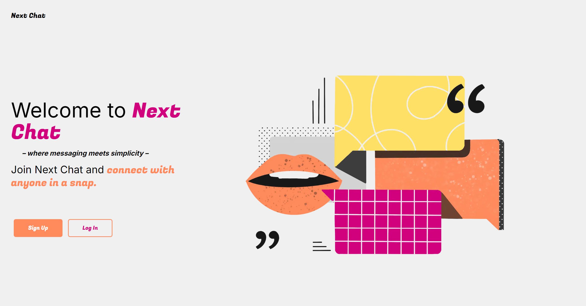
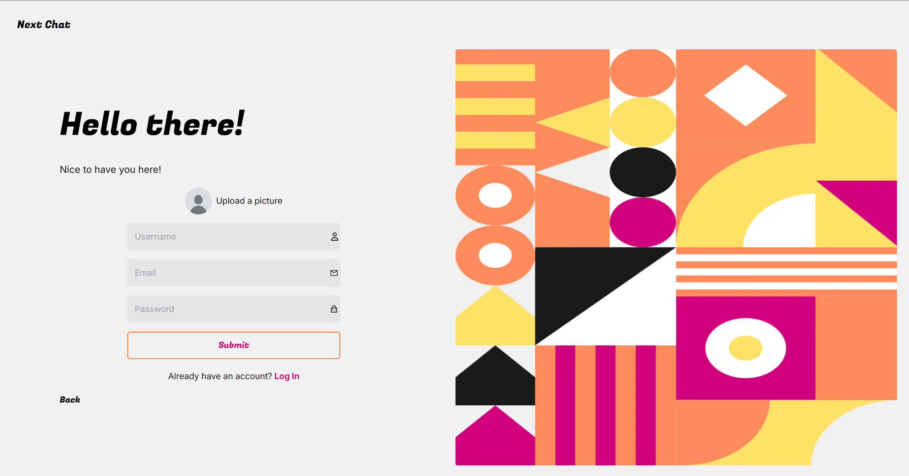
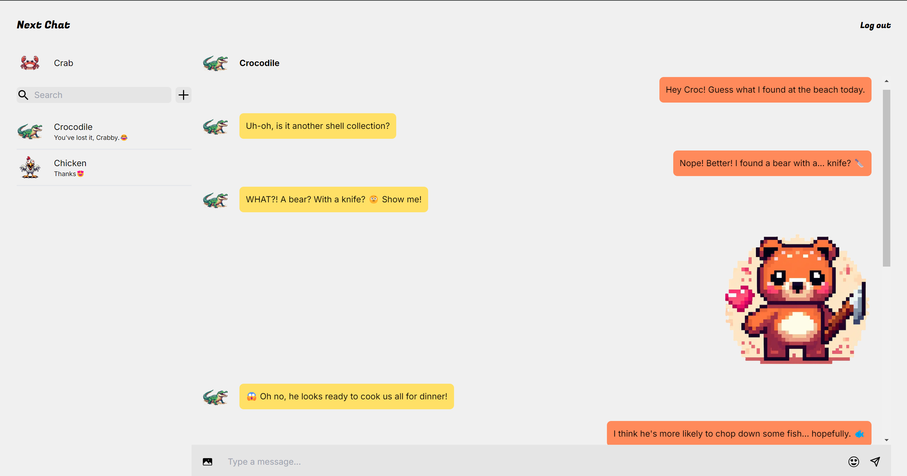
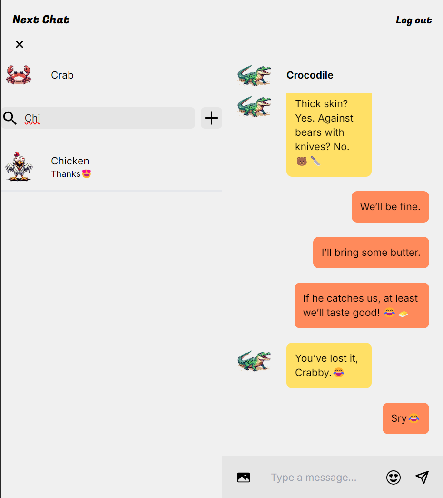

# Next Chat - Real-time Messaging App
Next Chat is a real-time messaging app built using Next.js, Firebase, and Tailwind CSS. The app allows users to register, log in, search for other users, connect with friends, and chat in real-time with support for text, images, and emojis. The app is fully responsive and optimized for mobile and desktop devices.



## Tech Stack
### Frontend:
* [![Next][Next.js]][Next-url]
### Styling:
* [![Tailwind][Tailwind]][tailwind-url]
### Backend & Database:

* [![Firebase][Firebase]][firebase-url]

## Features
- ### User Authentication:
Secure login and registration using Firebase Authentication.

- ### Real-time Chat and Multimedia Sharing:
Instant messaging powered by Firebase, ensuring smooth real-time communication.
Send images and emojis during chat conversations.

- ### Friend Management:
Add and manage friends, with the ability to filter and search within your friend list.

Find other registered users and start conversations even in mobile view.



## Setup and Installation
### Prerequisites
Ensure you have the following installed:

  - [![nodejs][node.js]][node-url]
  - [![npm][npm]][npm-url]


Clone the Repository
bash
```bash
git clone git@github.com:eszti9902/chat-app.git
```
- Navigate to the desired directory:
```bash
cd <directory>
```
- Install Dependencies
```bash
npm install
```
- Setup Firebase
    - Go to the Firebase Console and create a new project.
    - [![Firebase-console][Firebase-console]][firebase-console-url]
    - Enable Firebase Authentication (Email/Password).
    - Enable Firebase Realtime Database and configure the database rules (ensure rules allow read/write for authenticated users).
- Create a .env file at the root of your project and add your Firebase config:
```js
NEXT_PUBLIC_API_KEY=your-api-key
NEXT_PUBLIC_AUTH_DOMAIN=your-auth-domain
NEXT_PUBLIC_PROJECT_ID=your-project-id
NEXT_PUBLIC_STORAGE_BUCKET=your-storage-bucket
NEXT_PUBLIC_MESSAGING_SENDER_ID=your-messaging-sender-id
NEXT_PUBLIC_APP_ID=your-app-id
```
- Run the Development Server
```bash
npm run dev
```
- Open http://localhost:3000 to view the app in the browser.


[Next.js]: https://img.shields.io/badge/next.js-000000?style=for-the-badge&logo=nextdotjs&logoColor=white
[Next-url]: https://nextjs.org/

[Firebase]: https://img.shields.io/badge/firebase-001c55?style=for-the-badge&logo=firebase&logoColor=ff5400
[firebase-url]: https://firebase.google.com/

[Tailwind]: https://img.shields.io/badge/tailwind%20css-001c55?style=for-the-badge&logo=tailwindcss&logoColor=00b4d8
[tailwind-url]: https://tailwindcss.com/

[node.js]: https://img.shields.io/badge/Node.js-339933?style=for-the-badge&logo=nodedotjs&logoColor=white
[node-url]: https://nodejs.org/en

[npm]: https://img.shields.io/badge/npm-CB3837?style=for-the-badge&logo=npm&logoColor=white
[npm-url]: https://www.npmjs.com/

[Firebase-console]: https://img.shields.io/badge/firebase%20console-001c55?style=for-the-badge&logo=firebase&logoColor=ff5400
[firebase-console-url]: https://console.firebase.google.com/u/0/?_gl=1*v69sva*_ga*MjAyNzA1OTI5My4xNzIzOTI2ODU5*_ga_CW55HF8NVT*MTcyNzA3NjkwOS41OS4wLjE3MjcwNzY5MDkuMC4wLjA.